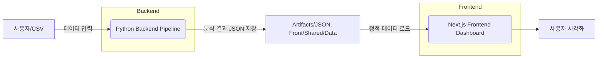
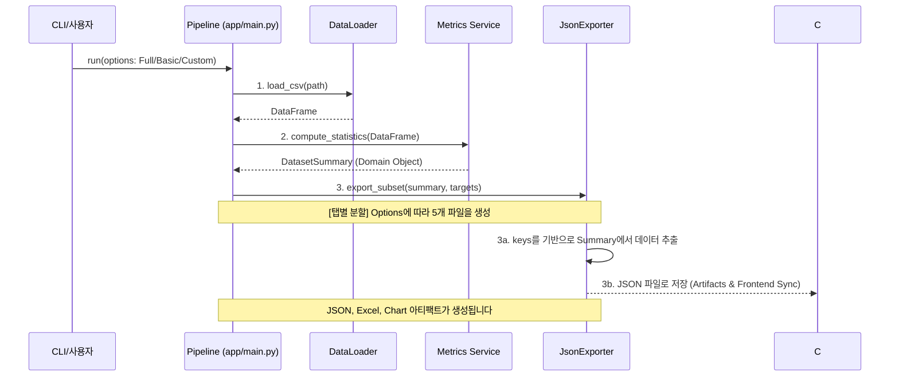
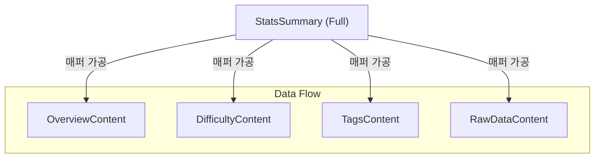

# Input / Output Design

본 문서는 데이터 분석 파이프라인의 시스템 경계와 데이터 흐름(Data Flow)을 정의합니다.

 

## 시스템 개요 (System Boundary)

본 시스템은 실시간 API 서버 없이, 백엔드 분석 파이프라인에서 생성된 **정적 JSON 아티팩트**를
프론트엔드가 직접 로드하는 구조로 설계되었습니다.

AWS 프리티어 정책 변경(계정 단위 → 카드 단위)으로 인해
기존에 사용 중인 계정 및 프로젝트들과 충돌이 발생하여
추가적인 서버 인스턴스를 생성하기 어려운 제약이 존재합니다.  
이에 따라 서버 운영 비용 없이도 안정적으로 동작할 수 있도록
정적 JSON 기반의 렌더링 방식을 선택하였습니다.

이 방식은 배포 환경 및 평가 환경에서 높은 재현성(Reproducibility)을 보장합니다.

## 입력 정의 (Inputs)

| 입력 요소              | 기본 경로 / 옵션                               | 역할                                         |
|--------------------|------------------------------------------|--------------------------------------------|
| **원본 데이터**         | `back/data/.../questions_dataset.csv`    | Kaggle에서 확보한 프로그래밍 문제 데이터셋입니다.             |
| **CLI 옵션 (분석 범위)** | `--analysis-scope [full, basic, custom]` | 파이프라인의 실행 범위(저장할 데이터의 양)를 결정합니다. *(매우 중요)* |
| **CLI 옵션 (경로)**    | `--data-file <path>`                     | 분석할 CSV 파일 경로를 재정의합니다.                     |
| **실행 환경 변수**       | `PYTHONPATH`                             | `back/src` 패키지 루트를 시스템 경로에 추가합니다.          |

 

## 데이터 처리 흐름 (Processing Flow)

백엔드 파이프라인은 4단계로 구성되며, 특히 데이터 로딩 및 통계 계산이 핵심입니다.

 

## 출력 아티팩트 정의 (Outputs)

분석 결과물은 백업용(Artifacts)과 프론트엔드 사용용(Sync) 두 곳에 저장됩니다. 프론트엔드에서는 탭 전환의 부드러움을 위해 데이터를 분할(Split)하여 소비합니다.

## A. 백엔드 아티팩트 (`back/artifacts/`)

아티팩트 그룹.

| 파일 그룹         | 경로        | 역할                                                             |
|---------------|-----------|----------------------------------------------------------------|
| **JSON (분할)** | `json/`   | `overview.json`, `difficulty.json` 등 프론트엔드 탭별 분할 JSON 전체 (백업용) |
| **Excel**     | `xlsx/`   | `overview.xlsx`, `difficulty.xlsx` 등 탭별 분할 Excel 리포트 (총 4개)    |
| **차트**        | `charts/` | `difficulty_distribution.png` 등 시각화 이미지 (디버깅/보고서용)             |

## B. 프론트엔드 동기화 (`front/src/shared/data`)

프론트엔드에서 소비하는 데이터.

| 파일명                   | 데이터 범위                             | 소비 탭                       |
|-----------------------|------------------------------------|----------------------------|
| **overview.json**     | 핵심 통계 (Easy/Medium/Hard 비율, 일별 추세) | Overview Content           |
| **difficulty.json**   | 난이도, 복잡도, 시계열 상세 메트릭               | Difficulty Content         |
| **tags.json**         | 알고리즘, 태그, 입력 타입 분포                 | Tags Content               |
| **structure.json**    | 길이, 제약조건, 예제 수 분포                  | Structure Content          |
| **summary-full.json** | 전체 `DatasetSummary` 원본             | Raw Data Content (다운로드 버튼) |

 

## 프론트엔드 데이터 소비 (Frontend Consumption)

프론트엔드는 서버 컴포넌트를 통해 StatsSummary를 받습니다. 이후 클라이언트 컴포넌트(useDashboardData 훅)가 탭 전환 시 URL 파라미터를 기반으로 해당하는 JSON 파일을 비동기적으로 가져옵니다.

