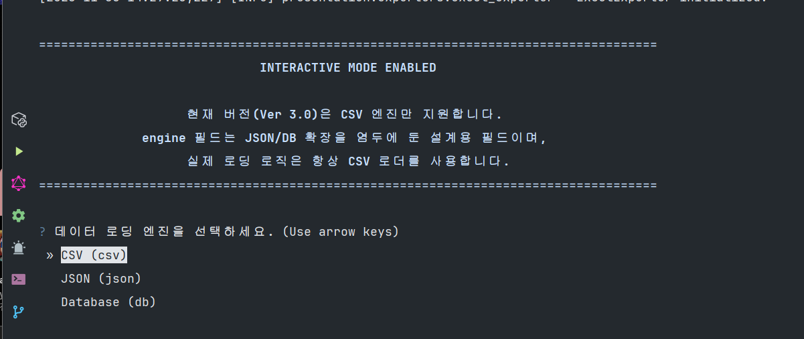
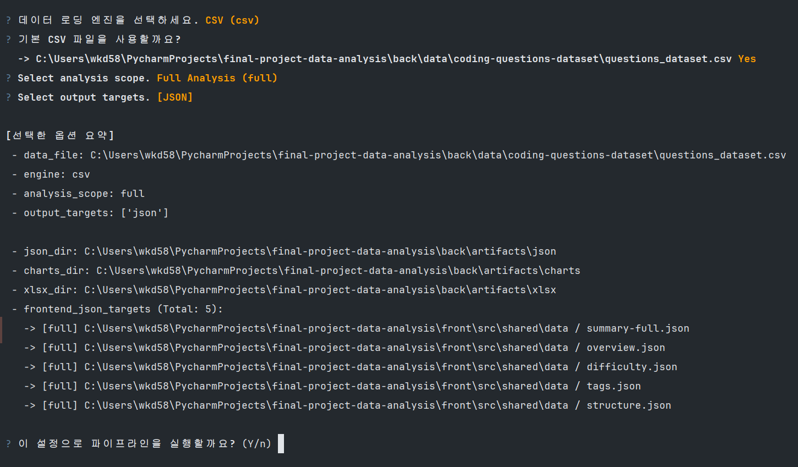
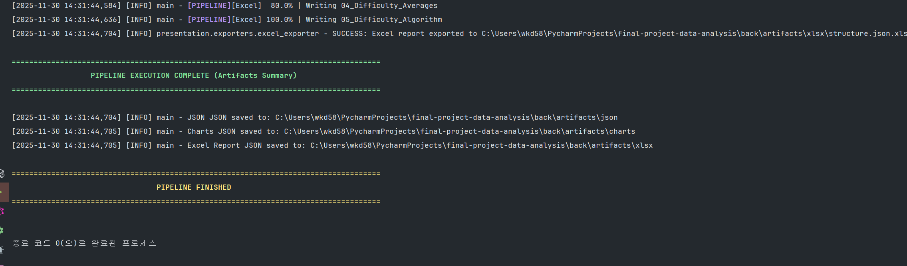

# Requirements Analysis
본 문서는 Kaggle [Coding Questions Dataset](https://www.kaggle.com/datasets/guitaristboy/coding-questions-dataset)을 기반으로 하는 데이터 분석 파이프라인과 
이를 시각화하는 대시보드 시스템의 요구사항을 정리합니다. 백엔드 분석 모듈은 CSV 데이터를 정제, 가공하여 정적 JSON 아티팩트를 생성하고, 프론트엔드는 이를 로드하여 시각적으로 표현합니다.

 

## Project Goal
- Kaggle 데이터셋을 기반으로 **재현성(Reproducibility)이 보장되는 데이터 분석 파이프라인**을 구축한다.
- 백엔드에서 생성한 분석 결과를 **정적 JSON 기반 대시보드**로 정리하여 비전공자(교수, 평가자 포함)도 쉽게 이해할 수 있는 형태로 시각화한다.

 

## Functional Requirements
### 데이터 로딩(Data Ingestion)
엔드 파이프라인은 기본적으로 back/data/coding-questions-dataset/questions_dataset.csv 파일을 입력으로 사용한다. 사용자는 CLI 옵션인 --data-file을 통해 다른 CSV 경로를 지정할 수 있으며, 모든 데이터는 UTF-8 인코딩을 기준으로 pandas DataFrame 형태로 적재된다.

이 단계는 후속 전처리와 통계 계산의 기반이 되는 핵심 과정이다.

#### 주요 기능
- 기본 CSV 자동 로딩
- `--data-file`플래그를 통한 경로 재정의
- pandas 기반 DataFrame 변환

### 전처리 및 데이터 정규화(Preprocessing & Enrichment)
로딩된 DataFrame은 분석 가능한 형태로 가공된다.

난이도(difficulty), 카테고리(category), 태그(tags) 등은 스키마에 맞게 정규화하며, 설명(description) 길이, 템플릿 사용 여부 등 텍스트 기반 특징치를 추가로 계산한다. 날짜 필드(created_at)는 파싱을 통해 시계열 분석(예: 일별 카운트)이 가능하도록 변환된다.

#### 주요 기능
- 난이도, 카테고리·태그 정규화
- 설명 길이·템플릿 사용 여부 계산
- 날짜 필드 파싱 및 시계열 준비

### 통계 생성(Statistics Generation)
정규화된 데이터는 다양한 통계 메트릭으로 변환된다.

난이도 분포, 알고리즘 태그 분포, 입력·출력 타입 분포 등의 범주형 통계뿐만 아니라, 예제 수, 테스트 케이스, 제약조건 수, 설명 길이 등 구조적 요소는 버킷 단위로 묶어 분석한다. 또한 일별 생성량이나 난이도 변화 같은 시계열 분석과, 난이도 × 카테고리, 난이도 × 입력 타입 같은 행렬 기반 분석도 수행된다.

#### 생성되는 주요 통계
- 난이도 분포
- 태그/알고리즘 유형 분포
- 입력/출력 타입 분포
- 구조적 메트릭(예제/테스트케이스/제약조건/설명 길이)
- 시계열 분석(일별 생성량, 난이도 변화 추세)
- 행렬 분석(난이도 × 카테고리/입력 타입)

## 아티팩트 생성(Artifact Export)
계산된 통계는 프론트엔드에서 바로 사용할 수 있도록 여러 형태의 아티팩트(JSON, Excel, 차트 이미지)로 저장된다.

프론트엔드 탭 구조에 맞추어 overview.json, difficulty.json, tags.json, structure.json, summary-full.json 등이 생성되며, 다음 위치에 저장된다
1. back/artifacts/json/ → 백업 및 분석 결과 보관용 
2. front/src/shared/data/ → 대시보드 렌더링 동기화용
3. front/src/public/data/ → 대시보드 렌더링 동기화용

 

## 프론트엔드 렌더링(Frontend Rendering)
백엔드에서 생성된 정적 JSON 아티팩트를 기반으로 Overview, Difficulty, Tags, Structure, Raw Data 등 5개의 대시보드 탭을 렌더링한다. 각 탭은 분포 그래프, 시계열 트렌드, 구조적 통계표 등을 표시하여 사용자가 분석 결과를 직관적으로 확인할 수 있도록 한다.

 

## 인터랙티브 CLI(Interactive CLI)

파이프라인은 인터랙티브 모드와 비상호작용 모드를 모두 지원한다.

사용자는 코드를 수정하지 않고도 analysis-scope, 출력 대상, 저장 옵션 등을 선택할 수 있다.

 

## 유지보수성(Maintainability)
백엔드는 Layered Architecture (app / domain / infrastructure / presentation) 구조를 따른다.
프론트엔드는 Feature-Sliced Design(app / entities / features / widgets / shared / view)을 적용하여관심사를 명확히 분리하고 유지보수성을 높였다.

 

## 이식성(Portability)
백엔드는 pandas, seaborn, matplotlib, openpyxl 등 표준 Python 라이브러리만 사용하며,
프론트엔드는 Next.js 기반의 표준 Node.js(18+) 환경에서 구동된다.

가상환경(venv) 또는 conda 환경을 권장한다.

 

## 성공 기준(Success Criteria)
- back 디렉토리에서 `python -m backend.app.main` 실행 시 오류 없이 최신 JSON/Excel/Chart 아티팩트가 생성된다.
- front/src/shared/data/*.json이 백엔드 출력과 스키마 충돌 없이 항상 동기화된다.
- npm run dev 실행 후 / 및 /dashboard 페이지가런타임 에러 없이 정상 렌더링된다.

### 실행 화면

