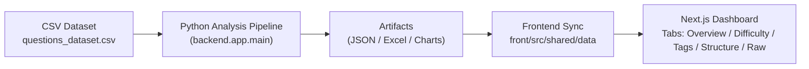
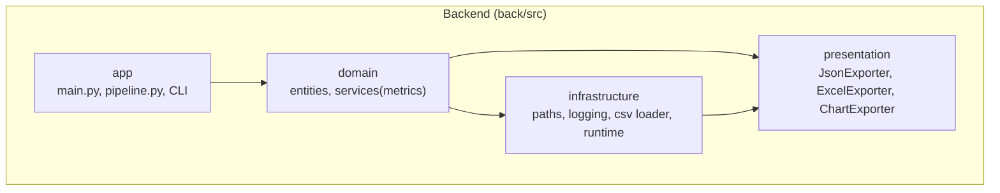
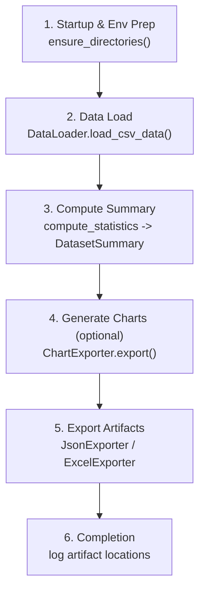
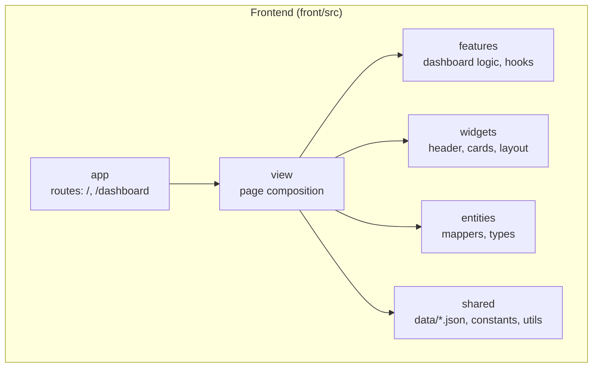
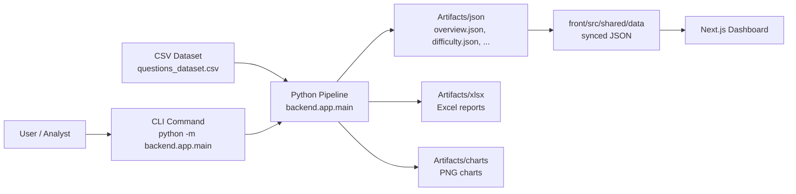

# System Architecture
본 문서는 백엔드 분석 파이프라인과 프론트엔드 대시보드가 어떻게 상호작용하며, 최종 분석 결과가 사용자에게 전달되는지를 아키텍처 관점에서 설명합니다.

 

## High-Level Overview

본 시스템은 **실시간 API 서버 없이**, 백엔드에서 생성된 **정적 JSON 아티팩트**를 프론트엔드가 직접 로드하는 구조로 동작합니다. 이 구조는 서버 인프라 없이도 높은 재현성과 안정성을 보장합니다.

- 백엔드: `back/src/backend` 패키지로 구성, 실행 엔트리포인트는 `app/main.py`
- 프론트엔드: Next.js(App Router) 기반, `front/src/shared/data`의 JSON 파일을 직접 import하여 렌더링

 

## Backend Architecture (back/src)
백엔드는 Layered Architecture를 기반으로 구성됩니다.

### **app**
- 파이프라인 전체를 오케스트레이션
- `main.py`, `pipeline.py`, CLI 파서, Interactive Prompt 포함
- 실행 옵션(PipelineOptions)을 생성하고 전체 흐름을 제어함

### **domain**
- 순수 분석 로직 및 엔티티 정의
- `domain/service/metrics.py`에서 모든 통계 계산 수행  
  (난이도·태그·입출력 타입·구조적 메트릭·시계열·행렬 분석)

### **infrastructure**
- 파일 경로, 로깅, CSV 로더, 런타임 환경 설정
- `runtime/venv.py` 등을 통한 환경 부트스트랩 기능 포함

### **presentation**
- 아티팩트 출력 담당
- JSON / Excel / Chart Exporter들이 존재하며  
  결과물을 디스크 및 프론트엔드 공유 폴더에 저장

 

## Pipeline Steps (app/pipeline.py)

### 1. **Startup & Environment Setup**  
- 실행 배너 출력, 버전 로깅  
- `ensure_directories()`로 출력 디렉토리 생성

### 2. **Data Load**  
- `DataLoader.load_csv_data()`  
- CSV → pandas DataFrame 변환  
- CLI 옵션(`--data-file`)으로 입력 경로 변경 가능

### 3. **Compute Summary**  
- `compute_statistics()` 실행  
- `DatasetSummary` 도메인 객체 생성  
- overview 메타데이터 + metrics(분포/버킷/행렬)

### 4. **Generate Charts (옵션)**  
- ChartExporter가 PNG 차트 생성  
- 개발·보고서용

### 5. **Export Artifacts**  
- JsonExporter: full + 탭별 JSON  
- ExcelExporter: 탭별 Excel 파일  
- 아티팩트는 `back/artifacts/*`에 저장되며 프론트엔드에서는 두 위치로 자동 동기화된다.
  - `front/src/shared/data` (빌드 타임 import 용)
  - `front/public/data` (런타임 fetch 용)

### 6. **Completion**  
- 최종 출력물 경로 로깅  
- 종료 배너 출력

 

## 4. Frontend Architecture (front/)
Next.js(App Router) 기반 구조이며, **정적 JSON 소비 중심**으로 구성됩니다.

### **app/**
- `/` 및 `/dashboard` 페이지 라우팅
- 서버 컴포넌트가 summary-full.json을 로드하여 초기 데이터 제공

### **entities/**
- JSON → Typed Object로 변환하는 매퍼 & 타입 정의 (Ex. `entities/summary/mapper.ts` → `StatsSummary`)

### **features/**
- 탭 전환 로직, 차트/테이블 렌더링 로직

### **widgets/**
- Header, Card 등 재사용 가능한 UI 컴포넌트

### **shared/**
- 정적 JSON 데이터 (`src/shared/data/*.json`)  
- 공통 상수 및 유틸성 코드

### **view/**
- 페이지 전체를 조립하는 Presentation 레이어  
- `view/main/main-page.tsx`에서 탭형 대시보드를 구성

 

## Data Flow (End-to-End)
전체 데이터 흐름은 분석자 입력부터 대시보드 렌더링까지 다음과 같은 단계를 거친다.

### 1. **사용자/분석자 실행**
- 분석자는 `back` 디렉토리에서 `python -m backend.app.main` 명령어를 실행하여 파이프라인을 시작한다.
- 이때 제공된 CLI 옵션(`--data-file`, `--analysis-scope`)에 따라 입력 경로 및 분석 범위가 결정된다.

### 2. **CSV 데이터 로딩**
- 파이프라인은 기본 CSV 파일(`questions_dataset.csv`) 또는 사용자가 지정한 CSV를 불러와 pandas DataFrame 형태로 변환한다.

### 3. **파이프라인 처리 (Statistics Pipeline)**
- 로드된 데이터는 전처리(정규화, 텍스트 특성 추출, 날짜 파싱)를 거친 후 `compute_statistics()`를 통해 `DatasetSummary` 도메인 객체로 요약된다.
- 이 Summary에는 개요 정보(overview), 분포(distributions), 버킷(buckets), 시계열(time-series), 행렬(matrix) 분석 결과가 포함된다.

### 4. **아티팩트 생성 (Artifacts Output)**
- 백엔드는 Summary를 기반으로 여러 종류의 아티팩트를 생성한다.
 - **JSON 분할 파일**: overview, difficulty, tags, structure, summary-full  
 - **Excel 보고서**: 탭별 xlsx 파일  
 - **차트 이미지(PNG)**: 분포·시계열 시각화 결과  
- 모든 아티팩트는 `back/artifacts/` 폴더에 저장된다.

### 5. **프론트엔드 동기화 (Frontend Sync)**
- 생성된 JSON 파일은 자동으로 `front/src/shared/data/`로 복사되어 Next.js 애플리케이션에서 직접 import 가능한 형태로 제공된다.
- 이 방식은 실시간 API 없이 **정적 데이터 기반 렌더링**을 가능하게 한다.

### 6. **Next.js 대시보드 렌더링**
- 프론트엔드는 `shared/data`에 있는 JSON을 로드하여 엔티티 매퍼(`toStats`, `mapToDifficultyStats` 등)를 적용한 뒤 Overview, Difficulty, Tags, Structure, Raw 탭을 구성한다.
- 각 탭은 분포 그래프, 구조적 통계표, 시계열 차트 등 다양한 시각화를 표시한다.

이 과정을 통해 CSV 입력 → 분석 → 아티팩트 생성 → JSON 동기화 → 대시보드 렌더링까지의 전체 흐름이  
일관된 구조로 완성된다.
