# Data Analysis User Manual
- [Project Deployment](https://jparkdev-data-analysis.vercel.app/)
- [Project Github Repository](https://github.com/JangHwanPark/final-project-data-analysis)
- [FrontEnd Github Repository](https://github.com/JangHwanPark/final-project-data-analysis/tree/main/front)
- [BackEnd Github Repository](https://github.com/JangHwanPark/final-project-data-analysis/tree/main/back)
- [Project Documentation](https://github.com/JangHwanPark/final-project-data-analysis/tree/main/docs)
- [BackEnd Documentation](https://github.com/JangHwanPark/final-project-data-analysis/tree/main/back/docs)

<br/>

## Runtime Environment
### Recommended Environment
- Windows 10/11
- Python 3.10+
- venv-based virtual environment(included in the project)

### Install Packages
프로그램 실행 전 아래 명령어로 필요한 패키지를 설치합니다.
```bash
pip install -r requirements.txt
```

<br/>

## How to Run the Program
### Run via Executable (.exe)
프로젝트에 포함된 analysis.exe 파일을 더블클릭하여 실행합니다.  
실행 시 CLI 인터페이스가 자동 실행되며 아래 순서대로 질문을 받습니다.
1. 데이터 로딩 엔진 선택 (CSV 고정)
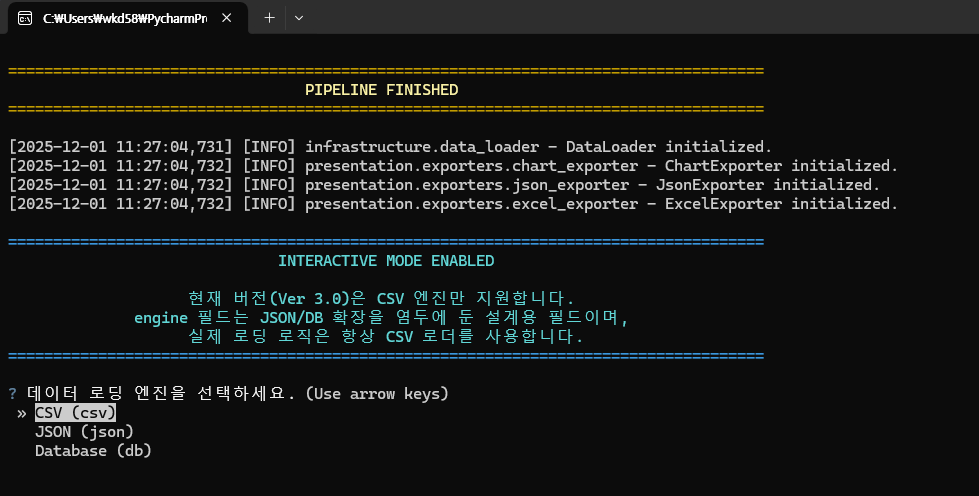
2. 데이터 파일 선택 
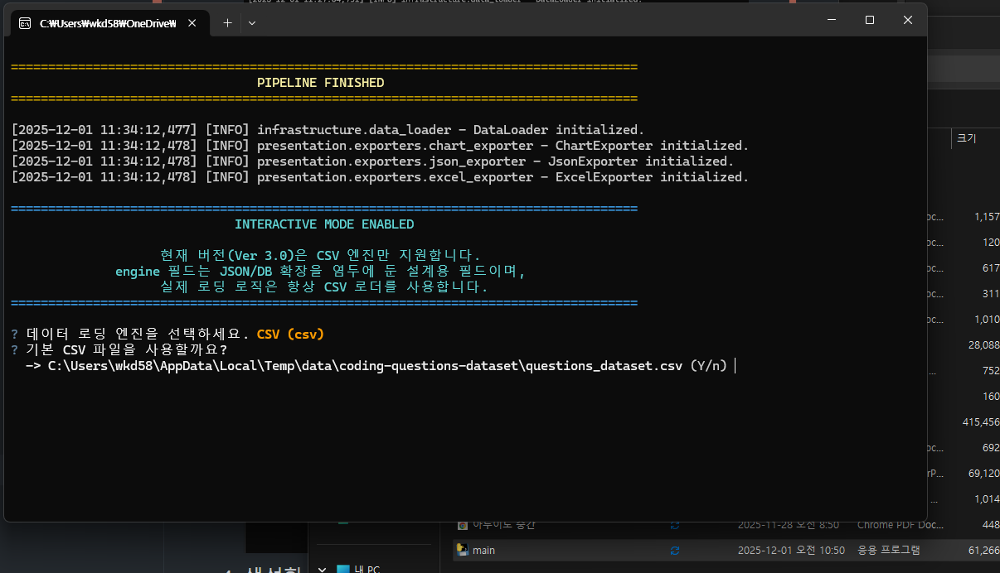
3. 분석 범위 선택 (Full / Basic / Custom)
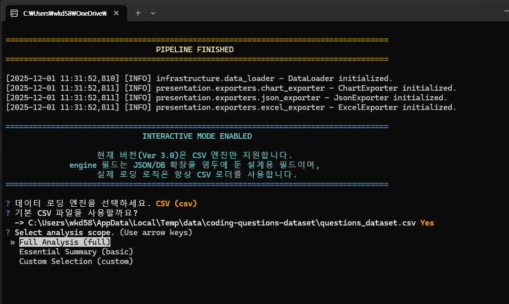
4. 생성할 아티팩트 선택 (JSON / Excel / Charts)
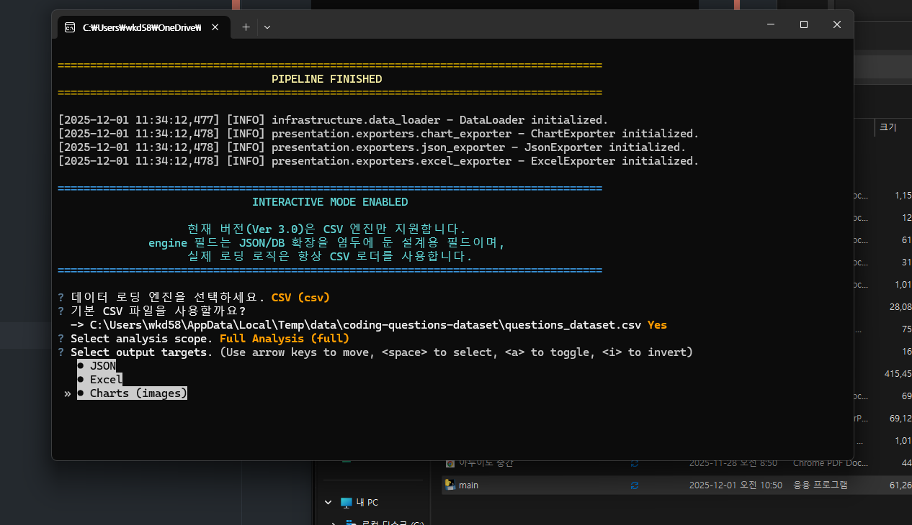
5. 결과 저장 디렉토리 선택 (기본 artifacts/ 또는 커스텀 경로)
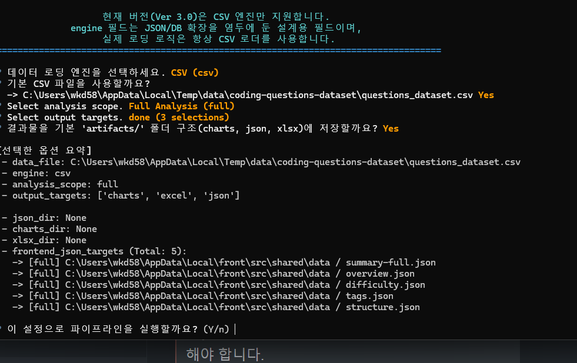
6. 최종 확인 후 실행
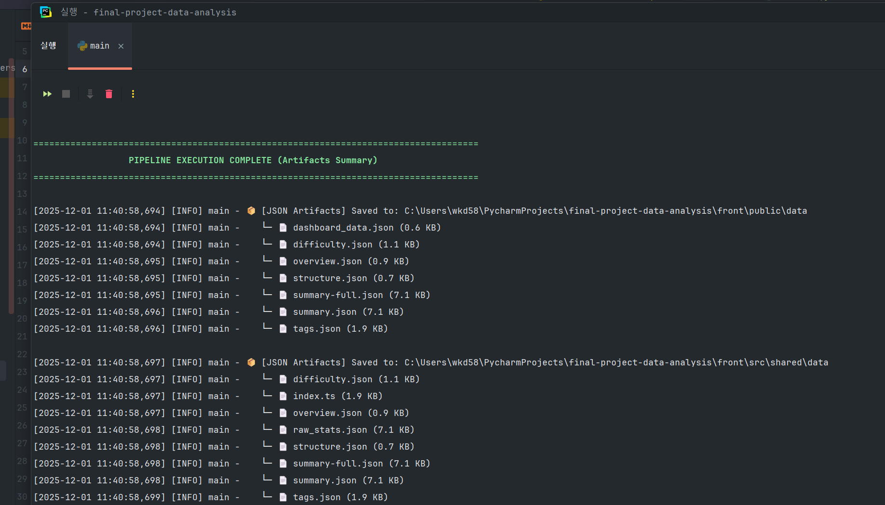

### Run via Python (Dev mode)
> Important: 실행은 반드시 back/src 폴더에서만 수행해야 합니다.  
> 프로토타입 구조상 패키지 루트가 src로 고정되어 있으며,
> 이 위치에서 실행해야 infrastructure, app, domain 등의 import가 정상 동작합니다.

#### Recommended Dev Command
프로젝트 루트에서 아래 명령어로 실행할 수 있습니다.
```bash
cd back/src
python -m app.main
```

#### 구방식: 프로젝트 루트에서 실행 — 현재 권장하지 않음
> ⚠️ 프로토타입 구조에서는 import 경로 이슈가 발생할 수 있습니다.
```bash
python src/app/main.py
```

<br/>

## Output Artifacts
프로그램이 정상적으로 실행되면 아래 폴더에 결과물이 생성됩니다.
```text
📁 artifacts/
 ├── json/        # 통계 JSON
 ├── charts/      # 차트 PNG 이미지
 ├── xlsx/        # Excel 리포트
 └── summaries/   # 프론트엔드 Dashboard용 summary.json
```

### Example Files
| Path                                         | Description |
| -------------------------------------------- | ----------- |
| artifacts/json/summary_full.json             | 전체 분석 요약    |
| artifacts/charts/difficulty_distribution.png | 난이도 분포 그래프  |
| artifacts/charts/top_tags.png                | 태그 상위 15개   |
| artifacts/xlsx/analysis_report.xlsx          | 전체 분석 리포트   |

<br/>

## BackEnd Analysis Features
프로그램은 다음과 같은 분석을 수행합니다.

### Overview
- 전체 문제 수 
- 날짜 범위 
- 난이도 분포 (Hard / Medium / Easy)

### Metrics
- 알고리즘 카테고리 분포 
- 입력 타입 분포 
- 태그 상위 15개 
- 난이도별 평균 설명 길이
- 테스트 케이스 평균 수
- 난이도 × 알고리즘 × 입력타입 매트릭스

### Charts
- 막대 / 도넛 그래프
- 혼합 그래프 (Average vs Test Cases)
- 프론트엔드에서 즉시 사용 가능하도록 자동 저장됨

<br/>

## FrontEnd Dashboard Overview
프론트엔드 대시보드의 Overview 페이지는 전체 데이터셋의 핵심 요약 정보를 시각화하여 한눈에 파악할 수 있는 메인 화면입니다.
백엔드에서 생성한 통계를 기반으로 다양한 차트와 메트릭을 제공합니다.

### Overview
[Overview 페이지 바로가기](https://jparkdev-data-analysis.vercel.app/)

Overview 페이지에서는 다음과 같은 주요 통계와 시각화를 확인할 수 있습니다.
- 총 문제 수 (Total Questions)
- 데이터 수집 기간 (Date Range)
- 난이도 분포(Hard / Medium / Easy)
- 예: 240H / 193M / 183E

또한 날짜별 문제 수, 난이도 비율, 입력 타입 분포 등 다양한 통계 시각화를 포함하고 있습니다.
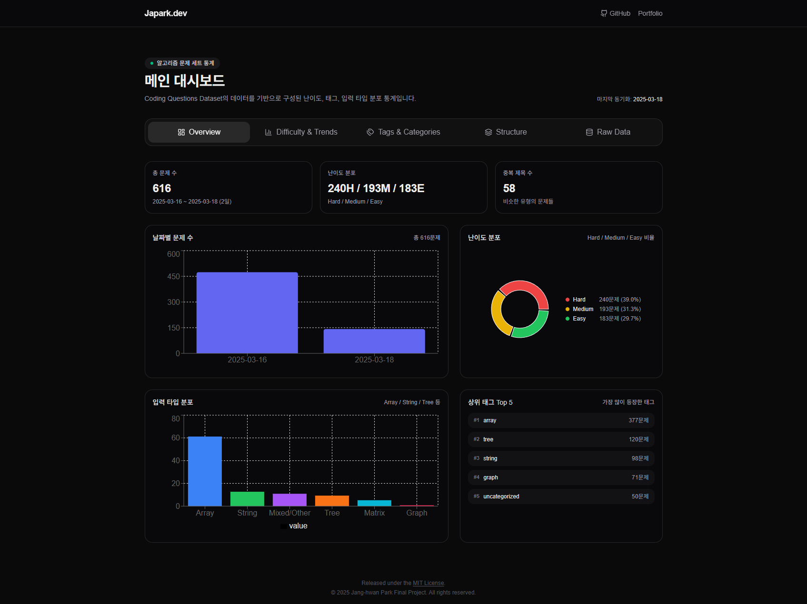

### Difficulty Insights
[Difficulty Insights 페이지 바로가기](https://jparkdev-data-analysis.vercel.app/)

이 페이지에서는 난이도별 트렌드와 문제의 복잡도 관련 지표를 확인할 수 있습니다.
- 날짜별 난이도 수량 변화 (Daily Difficulty Volume)
- 난이도별 평균 설명 길이(Avg Description Length)
- 난이도별 평균 테스트 케이스 수(Avg Test Cases)
- 차트 Hover 시 상세 수치 표시
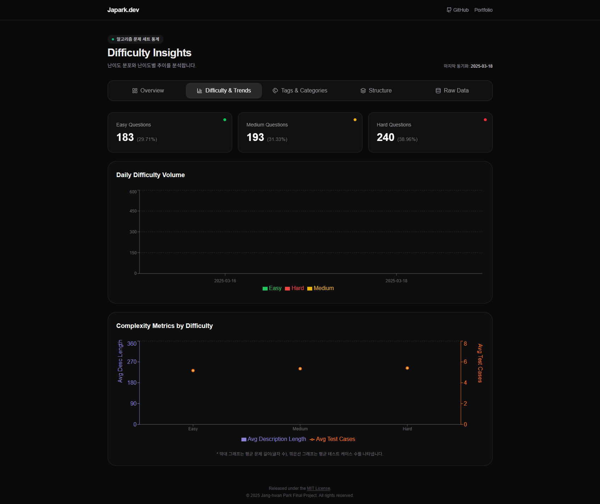

### Tag & Topics
[Tag & Topics 페이지 바로가기](https://jparkdev-data-analysis.vercel.app/)

문제에서 자주 등장한 태그 및 알고리즘 주제 분포를 시각화합니다.
이를 통해 문제 유형의 전반적인 경향을 확인할 수 있습니다.
- 예시: array, tree, string 등 
- 알고리즘 카테고리 분포 (Algorithm Categories)
- 입력 타입 분포 (Input Data Types)
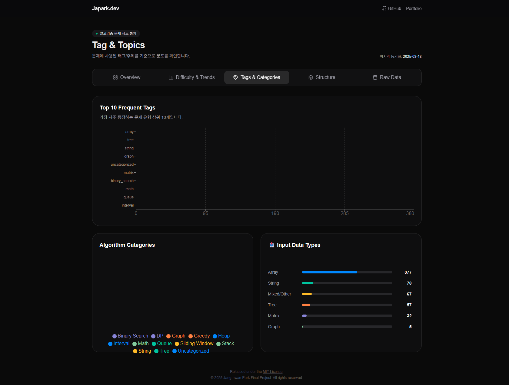

### Problem Structure
[Problem Structure 페이지 바로가기](https://jparkdev-data-analysis.vercel.app/)

문제 본문의 구조적 특징을 분석한 페이지입니다.  
문제 난이도와 구조적 복잡성을 파악할 수 있습니다.
- 설명 길이 분포 (Description Length Distribution)
- 제약 조건 수 (Constraints Count)
- 예시 케이스 수 (Example Cases Count)

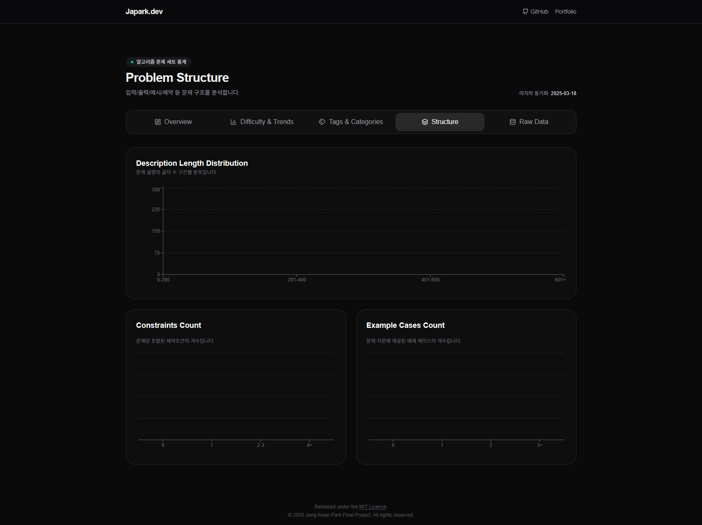

### Raw Data
[Raw Data 페이지 바로가기](https://jparkdev-data-analysis.vercel.app/)

백엔드에서 생성한 모든 JSON 분석 파일을 확인, 다운로드할 수 있습니다.
각 JSON은 Expand 기능을 통해 상세 내용을 확인할 수 있고, 다운로드도 가능합니다.
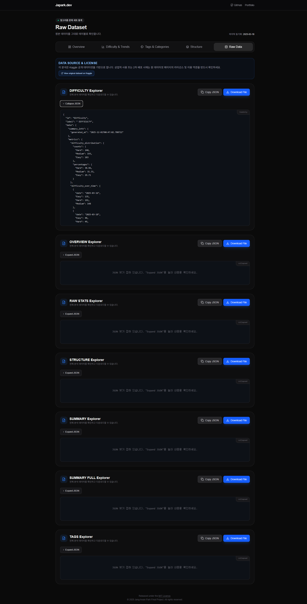

<br/>

## FrontEnd Performance
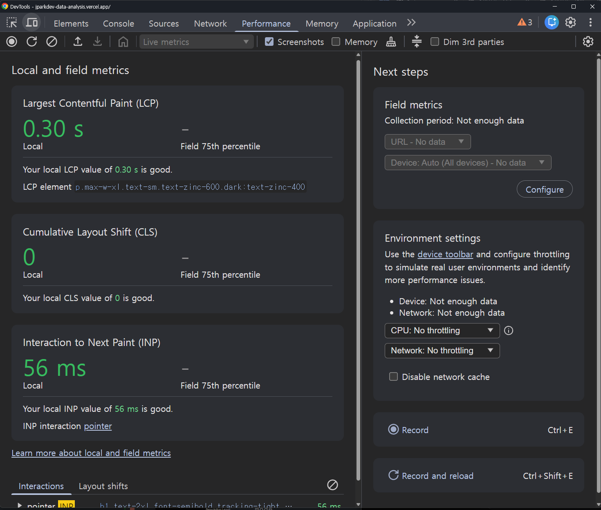
대시보드는 Next.js 14(App Router) 기반으로 구축되었으며, 정적 JSON 렌더링을 통해 매우 빠른 초기 로딩 성능을 제공합니다. Chrome DevTools Performance 검사 결과, 아래와 같이 모든 핵심 웹 지표(Core Web Vitals)에서 우수한 
성능을 기록했습니다.

이는 정적 데이터 로딩, 경량 UI 구성, 코드 스플리팅 및 렌더링 최적화가 적용된 결과입니다.

- **LCP (Largest Contentful Paint): 0.30s** — 매우 빠른 초기 렌더링  
- **CLS (Cumulative Layout Shift): 0** — 레이아웃 흔들림 없이 안정적인 화면  
- **INP (Interaction to Next Paint): 56ms** — 사용자 입력에 즉각 반응